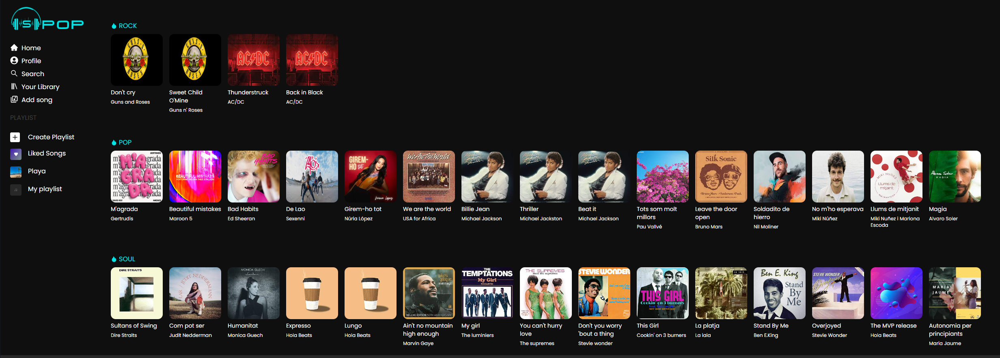
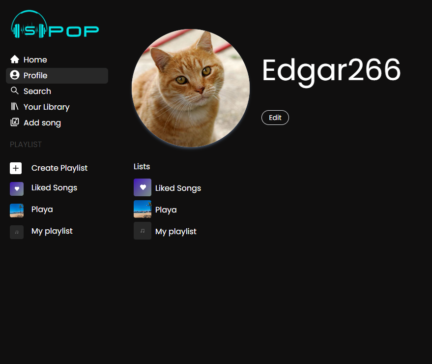
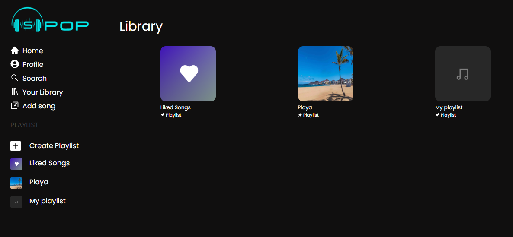
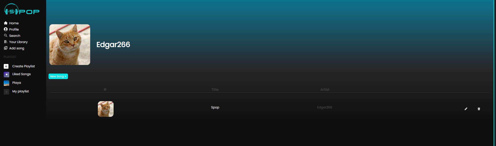
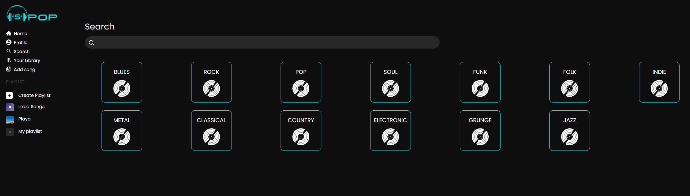

# SPOP(Spotify)
###### Creado por: Iñaki Garcia, Isaura Marti, Kenny Naranjo, Monica Reverte y Edgar Arcos

## Descripcion

Esto es una replica de Spotify con algunas funcionalidades de Instagram sin animo de lucro solo con fines educativos donde aplicamos base de datos no relacionales (NoSQL).

En esta aplicaciones web se puede subir canciones, escuchar musica, editar canciones, crear listas con tus canciones favoritas, gestinar usuarios para darle permisos de subida de canciones, editar listas y buscar canciones y usuarios para seguir las listas de estos.

Futuras Implementaciones:

Poder seguir artistas y que te notifique si sube contenido, gestion de estaditicas y gestion de lenguajes

## Tecnologias y librerias usadas

* Reactjs
* Tailwind
* Axios
* Auth0
* Cloudinary
* Json-Server
* Reactavatareditor
* ReactDOM
* ReactHookForm
* ReactHotToast
* ReactIcons
* ReactRouterDOM
* Uuid

## Instalar y ejecutar proyecto

1. Descargar [Visual Stuido Code](https://code.visualstudio.com)
2. Descargar [MongoDB](https://www.mongodb.com/products/compass)
2. Descargar Repositorio
3. Descargar [Postman](https://www.postman.com)
4. Descargar [NPM](https://www.npmjs.com)
4. Abir Visual Studio Code
5. Abrir desde Visual Studio Code el repositorio previamente descargado
6. Abrir la consola y ejecutar el comando npm i (se instalara todas las librerias anteriormente dichas)
7. Ejecutar npm run dev para que arranque el aplicacion
8. Hacer las pruebas que requiera con Postman o ThunderClient

## Imagenes Spop

https://github.com/EdgarArcos/Spop-Spotify-Backend/assets/119437039/3a6a24fc-539a-430f-8be9-cb153c450be1

